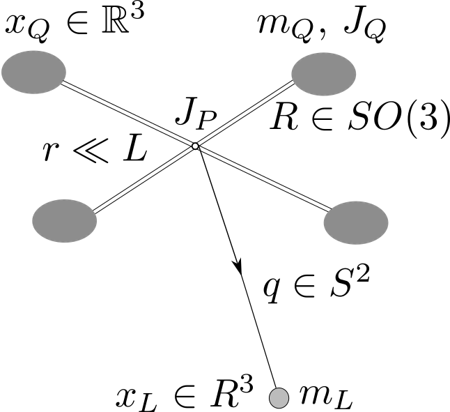

# Quad-Load-Pulley
We study a quadrotor with a cable-suspended load, where the cable length can be controlled by applying a torque on a pulley attached to the quadrotor. Under the assumption that the radius of the pulley is much smaller than the length of cable, a nonlinear geometric controller is developed, that enables tracking of outputs defined by either (a) quadrotor attitude, (b) load attitude, (c) load position and cable length. This mechanism could be applied to navigate through a sequence of windows of varying sizes.

<p align="center">

</p>

## References
If you find this project useful in your work, please consider citing following paper:
J. Zeng, P. Kotaru and K. Sreenath. "Geometric Control and Differential Flatness of a Quadrotor UAV with Load Suspended from a Pulley." *2019 American Control Conference (ACC)*. [[IEEE]](https://ieeexplore.ieee.org/document/8815173) 
```
@inproceedings{zeng2019pulley,
  author={Zeng, Jun and Kotaru, Prasanth and Sreenath, Koushil},
  booktitle={2019 American Control Conference (ACC)}, 
  title={Geometric Control and Differential Flatness of a Quadrotor UAV with Load Suspended from a Pulley}, 
  year={2019},
  volume={},
  number={},
  pages={2420-2427},
}